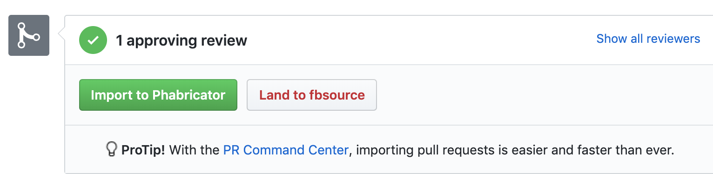

Pull Requests need to be reviewed and approved using GitHub's review feature before they can be merged. While anyone has the ability to review and approve a pull request, we typically only consider a pull request ready to be merged when the approval comes from one of the [contributors](https://github.com/facebook/react-native/blob/master/ECOSYSTEM.md).

Reviewing a pull request can take a considerable amount of time. In some cases, the review might require more time to perform than it took someone to write and submit their changes! It's therefore necessary to do some preliminary work to ensure each pull request is in a good state to be reviewed.

# Handling Pull Requests

A pull request should consist of three main sections:

- A summary. This helps us understand the motivation behind the changes.
- A changelog. This helps us write the release notes. It also serves as a brief summary of your changes.
- A test plan. This might be the most important part of your pull request. A test plan should be a reproducible step-by-step guide so that a reviewer can verify your change is working as intended. It's also a good idea to attach screenshots or videos for user visible changes.

Any one pull request may require a deeper understanding of some area of React Native that you may not be familiar with. Even if you don't feel like you are the right person to review a pull request, you may still help by adding labels or asking the author for more information.

Consider starting with pull requests that have been flagged as lacking a changelog or test plan.

- [PRs that appear to lack a changelog](https://github.com/facebook/react-native/pulls?utf8=%E2%9C%93&q=is%3Apr+is%3Aopen+label%3A%22Missing+Changelog%22+) - take a look and see if you can add the changelog yourself by editing the PR. After doing so, remove the "Missing Changelog” label.
- [PRs that are missing a test plan](https://github.com/facebook/react-native/pulls?q=is%3Apr+label%3A%22Missing+Test+Plan%22+is%3Aclosed) - open the pull request and look for a test plan. If the test plan looks sufficient, remove the "Missing Test Plan” label. If there is no test plan, or it looks incomplete, add a comment politely asking the author to consider adding a test plan.

A pull request must pass all the tests before it can be merged. They run on every commit on master and pull request. A quick way to help us get pull requests ready for review is to [search for pull requests that are failing the pre-commit tests](https://github.com/facebook/react-native/pulls?utf8=%E2%9C%93&q=is%3Apr+is%3Aopen+label%3A%22CLA+Signed%22+status%3Afailure+) and determine if they need to be revised. The failing test is usually listed near the bottom of the thread, under “Some checks were not successful.”

- Take a quick glance at the [latest tests runs on master](https://circleci.com/gh/facebook/react-native/tree/master). Is master green? If so,
  - Does it look like the failure may be related to the changes in this pull request? Ask the author to investigate.
  - Even if master is currently green, consider the possibility that the commits in the pull requests may be based off a commit from a point in time when master was broken. If you believe this may be the case, ask the author to rebase their changes on top of master in order to pull in any fixes that may have landed after they started working on the pull request.
- If master appears to be broken, look for any [issues labeled as “CI Test Failure”](https://github.com/facebook/react-native/issues?utf8=%E2%9C%93&q=is%3Aissue+is%3Aopen+label%3A%22%E2%9D%8CCI+Test+Failure%22+).
  - If you find an issue that seems related to the failure on master, go back to the pull request and thank the author for proposing these changes, and let them know that the test failure may be unrelated to their particular change (do not forget to link back to the CI Test Failure issue, as this will help the author know when they can try running tests again).
  - If you cannot find an existing CI Test Failure issue that describes the problem you've observed on master, please submit a new issue and use the “CI Test Failure” label to let others know that master is broken (see [this issue](https://github.com/facebook/react-native/issues/23108) for an example).

## Reviewing PRs

So you've found a pull request that you feel confident reviewing. Please make use of the GitHub Review feature, and clearly and politely communicate any suggested changes.

## How we prioritize PRs

Members of the React Native team at Facebook aim to review pull requests quickly and most PRs will get a response within a week.

## How does a PR get merged?

The React Native GitHub repository is actually a mirror of a subdirectory from one of Facebook's monorepos. Pull requests are therefore not merged in the traditional sense. Instead, they need to be imported into Facebook's internal code review system as a [“diff”](https://www.phacility.com/phabricator/differential/). Once imported, the changes will go through a suite of tests. Some of these tests are land-blocking, meaning they need to succeed before the contents of the diff can be merged. Facebook always runs React Native from master and some changes may require a Facebook employee to attach internal changes to your pull request before it can be merged. For example, if you rename a module name, all Facebook internal callsites have to be updated in the same change in order to merge it. If the diff lands successfully, the changes will eventually get synced back to GitHub by [ShipIt](https://github.com/facebook/fbshipit) as a single commit.

Facebook employees are using a custom browser extension for GitHub that can import a pull request in one of two ways: the pull request can be “landed to fbsource”, meaning it will be imported and the resulting diff will be approved automatically, and barring any failures, the changes will eventually sync back to master. A pull request may also be “imported to Phabricator”, meaning the changes will be copied to an internal diff that will require further review and approval before it can land.



**Appendix: Bots**

* **@pull-bot**: The Pull Bot automates several aspects of the pull request review process, such as making sure test plans and changelogs are used. It is based on Danger, and it is configured through the [`dangerfile`](https://github.com/facebook/react-native/blob/master/bots/dangerfile.js).
* **@analysis-bot**: Another helpful process that aids in pull request reviews, focusing mostly on lint and Flow checks. It is configured to run as part of the CI processes whenever a commit is added to a pull request.
* **@facebook-github-bot**: The Facebook GitHub Bot is used across several open source projects. In the case of React Native, you will most likely encounter it when it closes your pull request once your changes have been successfully merged to the React Native repository.

# Getting Ready to Submit Your First Pull Request

These instructions provide the step-by-step process to set up your machine to make contributions to the core React Native repository, and create your first pull request.

## Prologue: Getting Ready

You will need a few tools and dependencies in order to build and develop for React Native. These are covered as part of the [Getting Started](https://facebook.github.io/react-native/docs/getting-started) guide under the "Building Projects with Native Code" section.

In order to accept your pull request, we need you to submit a [Contributor License Agreement (CLA)](https://github.com/facebook/react-native/wiki/Contributor-License-Agreement). You only need to do this once to work on any of Facebook's open source projects. It only takes a minute so you can do it while you wait for your dependencies to install.

## Chapter I: Welcome to Open Source

### 1. Install `git`

The React Native source code is hosted on GitHub. You can interact with the git version control through the `git` command line program. We recommend you follow [GitHub's instructions](https://help.github.com/articles/set-up-git/) to set up git on your machine.

### 2. Get the source code

While you can browse the source code for React Native on [GitHub](https://github.com/facebook/react-native), we recommend you set up a fork on your local machine.

1. Go to <https://github.com/facebook/react-native>.
2. Click on Fork on the upper right.
3. When asked, select your username as the host for this fork.

You will now have a fork of React Native on GitHub at <https://github.com/your_username/react-native>. Next, you will grab a copy of the source code for your local machine. Open a shell and type the following commands:

```
git clone https://github.com/facebook/react-native.git
git remote add fork https://github.com/your_username/react-native.git
```

> _If the above seems new to you, do not be scared. You can access a shell through the Terminal application on macOS and linux, or PowerShell on Windows._

A new `react-native/` directory will be created with the contents of the core React Native repository. This directory is actually a clone of the React Native git repository. It is set up with two remotes: `origin` for the upstream https://github.com/facebook/react-native repository, and `fork` for the fork of React Native on your own GitHub account.

### 3. Create a branch

We recommend creating a new branch in your fork to keep track of your changes:

```
git checkout --branch my_feature_branch --track origin/master
```

## Chapter II: Implementing your Changes

### 1. Make changes to the code

You can now make any changes deemed necessary using your code editor of choice. [Visual Studio Code](https://code.visualstudio.com/) is popular with JavaScript developers. If you're mostly making changes to iOS or Android, using Xcode or Android Studio might provide a nicer integrated experience.

### 2. Test your changes

Make sure your changes are correct and do not introduce any test failures. You can learn more in [Running and Writing Tests](https://github.com/facebook/react-native/wiki/Tests).

### 3. Lint your code

We understand it can take a while to ramp up and get a sense of the style followed for each of the languages in use in the core React Native repository. Developers should not need to worry about minor nits, so whenever possible, we use tools that automate the process of rewriting your code to follow conventions.

For example, we use [Prettier](https://prettier.io/) to format our JavaScript code. This saves you time and energy as you can let Prettier fix up any formatting issues automatically through its editor integrations, or by manually running `npm run prettier`. We also use a linter to catch styling issues that may exist in your code. You can check the status of your code styling by simply running `npm run lint`.

To learn more about coding conventions, refer to the [Coding Style guide](http://github.com/facebook/react-native/wiki/How-to-Contribute#coding-style).

### 4. View your changes

Many popular editors integrate with source control in some way. You can also use `git status` and `git diff` on the command line to keep track of what has changed.

## Chapter III: Proposing your Changes

### 1. Commit your changes

Make sure to add your changes to version control using `git`:

```
git add <filename>
git commit -m <message>
```

You can use a short descriptive sentence as your commit message.

_> Worried about writing good git commit messages? Do not fret. Later, when your pull request is merged, all your commits will be squashed into a single commit. It is your pull request description which will be used to populate the message for this squashed commit._

This guide covers just enough to help you along with your first contribution. GitHub has several resources to help you get started with git:

- [Using Git](https://help.github.com/en/categories/using-git)
- [The GitHub Flow](https://guides.github.com/introduction/flow/)

### 2. Push your changes to GitHub

Once your changes have been commited to version control, you can push them to GitHub.

```
git push fork <my_feature_branch>
```

If all goes well, you will see a message encouraging you to open a pull request:

```
remote:
remote: Create a pull request for 'your_feature_branch' on GitHub by visiting:
remote:      https://github.com/your_username/react-native/pull/new/your_feature_branch
remote:
```

Visit the provided URL to proceed to the next step.

### 3. Create your pull request

You are almost there! The next step is to fill out the pull request. Use a descriptive title that is not too long. Then, make sure to fill out all of the fields provided by the default pull request template:

* **Summary:** Use this field to provide your motivation for sending this pull request. What are you fixing?
* **[Changelog](https://github.com/facebook/react-native/wiki/Changelog):** Help release maintainers write release notes by providing a short description of what will be changed should the pull request get merged.
* **Test Plan:** Let reviewers know how you tested your changes. Did you consider any edge cases? Which steps did you follow to make sure your changes have the desired effect? See [What is a Test Plan?](https://medium.com/@martinkonicek/what-is-a-test-plan-8bfc840ec171) to learn more.

### 4. Review and address feedback

Keep an eye on any comments and review feedback left on your pull request on GitHub. Maintainers will do their best to provide constructive, actionable feedback to help get your changes ready to be merged into the core React Native repository.
